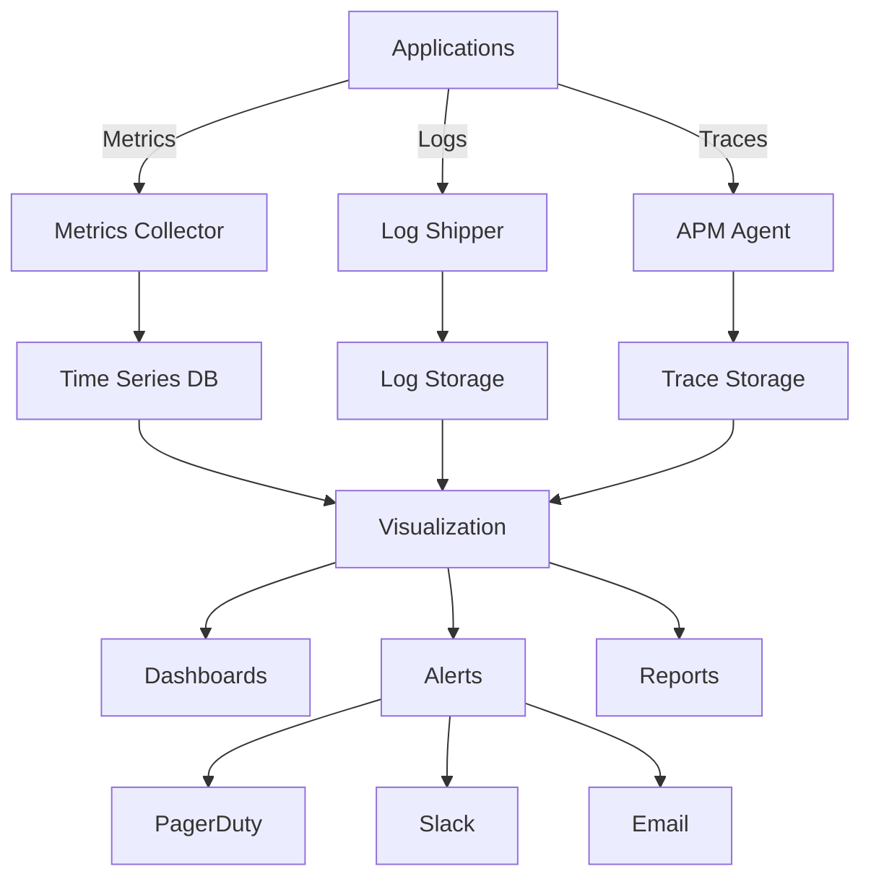

# White Cross Healthcare Platform - Monitoring & Observability Setup

## Executive Summary

This document provides comprehensive monitoring and observability configuration for the White Cross Healthcare Platform, ensuring HIPAA-compliant tracking of system health, performance, security, and user experience metrics.

---

## Table of Contents

1. [Monitoring Architecture](#monitoring-architecture)
2. [Key Performance Indicators](#key-performance-indicators)
3. [Application Monitoring](#application-monitoring)
4. [Infrastructure Monitoring](#infrastructure-monitoring)
5. [Security Monitoring](#security-monitoring)
6. [Database Monitoring](#database-monitoring)
7. [Alert Configuration](#alert-configuration)
8. [Dashboard Setup](#dashboard-setup)
9. [Log Aggregation](#log-aggregation)
10. [Incident Response](#incident-response)

---

## Monitoring Architecture

### Technology Stack

```yaml
monitoring_stack:
  metrics:
    primary: Datadog
    alternatives:
      - Prometheus + Grafana
      - New Relic
      - CloudWatch

  logging:
    aggregation: ELK Stack (Elasticsearch, Logstash, Kibana)
    alternatives:
      - Splunk
      - CloudWatch Logs
      - Datadog Logs

  tracing:
    apm: Datadog APM
    alternatives:
      - Jaeger
      - Zipkin
      - New Relic APM

  uptime:
    synthetic: Pingdom
    alternatives:
      - StatusCake
      - Datadog Synthetics
      - UptimeRobot

  security:
    siem: Splunk Security
    alternatives:
      - AWS Security Hub
      - Azure Sentinel
```

### Data Flow Architecture



---

## Key Performance Indicators

### Business KPIs

| Metric | Target | Warning | Critical | Measurement |
|--------|--------|---------|----------|-------------|
| User Satisfaction Score | >4.5/5 | <4.0 | <3.5 | User surveys |
| System Availability | 99.99% | <99.95% | <99.9% | Uptime monitoring |
| PHI Access Compliance | 100% | <99.9% | <99% | Audit logs |
| Response Time (p95) | <200ms | >300ms | >500ms | APM |
| Error Rate | <0.1% | >0.5% | >1% | APM |
| Active Users | >1000/day | <500 | <100 | Analytics |
| Support Tickets | <20/day | >50 | >100 | Help desk |

### Technical KPIs

| Metric | Target | Warning | Critical | Measurement |
|--------|--------|---------|----------|-------------|
| CPU Utilization | <70% | >80% | >90% | Infrastructure metrics |
| Memory Usage | <80% | >85% | >95% | Infrastructure metrics |
| Database Query Time | <50ms | >100ms | >200ms | Database monitoring |
| API Latency (p50) | <100ms | >150ms | >300ms | APM |
| Cache Hit Rate | >95% | <90% | <80% | Redis metrics |
| Queue Depth | <100 | >500 | >1000 | Queue monitoring |
| Disk I/O | <80% | >90% | >95% | Infrastructure metrics |

---

## Application Monitoring

### Frontend Monitoring

#### Real User Monitoring (RUM)

```javascript
// Datadog RUM Configuration
import { datadogRum } from '@datadog/browser-rum';

datadogRum.init({
    applicationId: process.env.REACT_APP_DD_APPLICATION_ID,
    clientToken: process.env.REACT_APP_DD_CLIENT_TOKEN,
    site: 'datadoghq.com',
    service: 'whitecross-frontend',
    env: process.env.NODE_ENV,
    version: process.env.REACT_APP_VERSION,
    sessionSampleRate: 100,
    sessionReplaySampleRate: 20,
    trackUserInteractions: true,
    trackResources: true,
    trackLongTasks: true,
    defaultPrivacyLevel: 'mask-user-input', // HIPAA compliance

    // Custom configuration for healthcare data
    beforeSend: (event, context) => {
        // Redact PHI from events
        if (event.type === 'error') {
            event.error.message = redactPHI(event.error.message);
        }
        return event;
    }
});

// Track custom user actions
datadogRum.addAction('health_record_viewed', {
    record_type: 'vaccination',
    student_id_hash: hashStudentId(studentId) // Never log actual IDs
});

// Track performance metrics
datadogRum.addTiming('api_call_duration', duration);
```

#### Performance Monitoring

```javascript
// Web Vitals Monitoring
import { getCLS, getFID, getFCP, getLCP, getTTFB } from 'web-vitals';

function sendToAnalytics(metric) {
    // Send to monitoring service
    datadog.gauge(`web_vitals.${metric.name}`, metric.value, {
        tags: [
            `page:${window.location.pathname}`,
            `rating:${metric.rating}`
        ]
    });

    // Alert on poor performance
    if (metric.rating === 'poor') {
        console.warn(`Poor ${metric.name}: ${metric.value}`);
    }
}

getCLS(sendToAnalytics);  // Cumulative Layout Shift
getFID(sendToAnalytics);  // First Input Delay
getFCP(sendToAnalytics);  // First Contentful Paint
getLCP(sendToAnalytics);  // Largest Contentful Paint
getTTFB(sendToAnalytics); // Time to First Byte
```

### Backend Monitoring

#### Application Performance Monitoring (APM)

```javascript
// Datadog APM Setup for Node.js
const tracer = require('dd-trace').init({
    service: 'whitecross-api',
    env: process.env.NODE_ENV,
    version: process.env.APP_VERSION,
    logInjection: true,
    profiling: true,
    runtimeMetrics: true,

    // HIPAA-compliant configuration
    tags: {
        'compliance': 'hipaa',
        'data_classification': 'phi'
    },

    // Sampling rules
    samplingRules: [
        // Sample all health record operations
        { service: 'health-records', sample_rate: 1.0 },
        // Sample 50% of regular operations
        { service: '*', sample_rate: 0.5 }
    ]
});

// Custom instrumentation
app.use((req, res, next) => {
    const span = tracer.scope().active();
    if (span) {
        span.setTag('user.role', req.user?.role);
        span.setTag('school.id', req.user?.schoolId);
        // Never log PHI in spans
        span.setTag('request.has_phi', containsPHI(req));
    }
    next();
});

// Database query monitoring
const { Sequelize } = require('sequelize');
sequelize.addHook('beforeFind', (options) => {
    const span = tracer.startSpan('sequelize.query', {
        tags: {
            'db.statement': options.logging ? 'logged' : 'not_logged',
            'db.table': options.model?.tableName
        }
    });
    options._span = span;
});

sequelize.addHook('afterFind', (result, options) => {
    if (options._span) {
        options._span.setTag('db.rows_affected', result?.length || 0);
        options._span.finish();
    }
});
```

#### Custom Metrics

```javascript
// Custom Business Metrics
const StatsD = require('node-dogstatsd').StatsD;
const dogstatsd = new StatsD();

// Health record access metrics
function trackHealthRecordAccess(recordType, action, userId) {
    dogstatsd.increment('health_records.access', 1, {
        tags: [
            `type:${recordType}`,
            `action:${action}`,
            `role:${getUserRole(userId)}`
        ]
    });
}

// Medication administration tracking
function trackMedicationAdministration(medicationType, schoolId) {
    dogstatsd.increment('medications.administered', 1, {
        tags: [
            `type:${medicationType}`,
            `school:${schoolId}`
        ]
    });
}

// Performance metrics
function trackApiPerformance(endpoint, duration, statusCode) {
    dogstatsd.histogram('api.request.duration', duration, {
        tags: [
            `endpoint:${endpoint}`,
            `status:${statusCode}`,
            `status_family:${Math.floor(statusCode / 100)}xx`
        ]
    });
}
```

---

## Infrastructure Monitoring

### Server Monitoring

```yaml
# Datadog Agent Configuration
init_config:

instances:
  - min_collection_interval: 15

logs:
  - type: file
    path: /var/log/whitecross/*.log
    service: whitecross
    source: nodejs
    tags:
      - env:production
      - compliance:hipaa

process_config:
  enabled: true
  intervals:
    container: 10
    process: 30

apm_config:
  enabled: true
  env: production
  analyzed_spans:
    whitecross|express.request: 1
    whitecross|sequelize.query: 1

# CloudWatch Agent Configuration
{
  "metrics": {
    "namespace": "WhiteCross/Production",
    "metrics_collected": {
      "cpu": {
        "measurement": [
          {"name": "cpu_usage_idle", "rename": "CPU_IDLE", "unit": "Percent"},
          {"name": "cpu_usage_iowait", "rename": "CPU_IOWAIT", "unit": "Percent"}
        ],
        "metrics_collection_interval": 60
      },
      "disk": {
        "measurement": [
          {"name": "used_percent", "rename": "DISK_USED", "unit": "Percent"}
        ],
        "metrics_collection_interval": 60,
        "resources": ["*"]
      },
      "mem": {
        "measurement": [
          {"name": "mem_used_percent", "rename": "MEM_USED", "unit": "Percent"}
        ],
        "metrics_collection_interval": 60
      },
      "net": {
        "measurement": [
          {"name": "bytes_sent", "rename": "NET_SENT", "unit": "Bytes"},
          {"name": "bytes_recv", "rename": "NET_RECV", "unit": "Bytes"}
        ],
        "metrics_collection_interval": 60
      }
    }
  }
}
```

### Container Monitoring

```yaml
# Kubernetes Monitoring with Prometheus
apiVersion: v1
kind: ConfigMap
metadata:
  name: prometheus-config
  namespace: monitoring
data:
  prometheus.yml: |
    global:
      scrape_interval: 15s
      evaluation_interval: 15s

    scrape_configs:
      - job_name: 'kubernetes-pods'
        kubernetes_sd_configs:
          - role: pod
        relabel_configs:
          - source_labels: [__meta_kubernetes_pod_annotation_prometheus_io_scrape]
            action: keep
            regex: true
          - source_labels: [__meta_kubernetes_namespace]
            action: replace
            target_label: namespace
          - source_labels: [__meta_kubernetes_pod_name]
            action: replace
            target_label: pod

      - job_name: 'kubernetes-nodes'
        kubernetes_sd_configs:
          - role: node
        relabel_configs:
          - action: labelmap
            regex: __meta_kubernetes_node_label_(.+)

      - job_name: 'whitecross-api'
        metrics_path: /metrics
        static_configs:
          - targets:
            - api.whitecross.health:9090
            labels:
              service: 'whitecross-api'
              env: 'production'
```

### Network Monitoring

```bash
#!/bin/bash
# Network Performance Monitoring Script

# Monitor network latency
while true; do
    # Check API endpoint latency
    LATENCY=$(curl -w "%{time_connect}" -o /dev/null -s https://api.whitecross.health/health)
    echo "whitecross.network.latency.api:${LATENCY}|ms" | nc -w 1 -u localhost 8125

    # Check database connectivity
    DB_LATENCY=$(psql -h prod-db -c "\timing" -c "SELECT 1" 2>&1 | grep "Time:" | awk '{print $2}')
    echo "whitecross.network.latency.database:${DB_LATENCY}|ms" | nc -w 1 -u localhost 8125

    # Check Redis latency
    REDIS_LATENCY=$(redis-cli -h prod-cache --latency-history | tail -1 | awk '{print $2}')
    echo "whitecross.network.latency.redis:${REDIS_LATENCY}|ms" | nc -w 1 -u localhost 8125

    sleep 30
done
```

---

## Security Monitoring

### HIPAA Compliance Monitoring

```javascript
// PHI Access Monitoring
class PHIAccessMonitor {
    constructor(logger, metrics) {
        this.logger = logger;
        this.metrics = metrics;
    }

    trackAccess(userId, patientId, recordType, action) {
        // Log for audit trail
        this.logger.audit({
            event: 'PHI_ACCESS',
            userId: userId,
            patientIdHash: this.hashId(patientId),
            recordType: recordType,
            action: action,
            timestamp: new Date().toISOString(),
            ipAddress: this.getClientIP(),
            userAgent: this.getUserAgent()
        });

        // Track metrics
        this.metrics.increment('phi.access', {
            tags: [
                `action:${action}`,
                `record_type:${recordType}`,
                `user_role:${this.getUserRole(userId)}`
            ]
        });

        // Check for suspicious patterns
        this.detectAnomalies(userId, action);
    }

    detectAnomalies(userId, action) {
        const recentAccesses = this.getRecentAccesses(userId);

        // Detect bulk access
        if (recentAccesses.length > 100) {
            this.alert('BULK_PHI_ACCESS', {
                userId: userId,
                count: recentAccesses.length,
                timeframe: '5_minutes'
            });
        }

        // Detect after-hours access
        const hour = new Date().getHours();
        if (hour < 6 || hour > 20) {
            this.metrics.increment('phi.after_hours_access');
        }

        // Detect unusual access patterns
        if (this.isUnusualPattern(userId, action)) {
            this.alert('UNUSUAL_ACCESS_PATTERN', {
                userId: userId,
                pattern: action
            });
        }
    }
}
```

### Security Event Monitoring

```yaml
# Security Information and Event Management (SIEM) Rules
rules:
  - name: "Multiple Failed Login Attempts"
    condition: |
      event.type == "authentication" AND
      event.outcome == "failure" AND
      count() BY user.name > 5
    timeframe: "5m"
    severity: "high"
    action:
      - alert
      - block_user

  - name: "PHI Bulk Access"
    condition: |
      event.category == "phi_access" AND
      count() BY user.id > 100
    timeframe: "10m"
    severity: "critical"
    action:
      - alert
      - suspend_access
      - notify_compliance

  - name: "Unauthorized API Access"
    condition: |
      http.response.status_code == 403 AND
      count() BY source.ip > 10
    timeframe: "1m"
    severity: "medium"
    action:
      - alert
      - rate_limit

  - name: "Data Exfiltration Attempt"
    condition: |
      network.bytes.outbound > 100MB AND
      destination.ip NOT IN trusted_ips
    timeframe: "5m"
    severity: "critical"
    action:
      - alert
      - block_connection
      - incident_response
```

### Intrusion Detection

```bash
#!/bin/bash
# Intrusion Detection System (IDS) Configuration

# AIDE (Advanced Intrusion Detection Environment) config
cat > /etc/aide/aide.conf <<EOF
# HIPAA-compliant file integrity monitoring
database=file:/var/lib/aide/aide.db
database_out=file:/var/lib/aide/aide.db.new
gzip_dbout=yes

# Critical system files
/bin R
/sbin R
/usr/bin R
/usr/sbin R
/lib R
/lib64 R

# Application files
/opt/whitecross R+sha256
/etc/whitecross R+sha256

# PHI data directories - monitor all access
/var/lib/whitecross/data R+sha512+audit

# Log files - monitor for tampering
/var/log L+sha256

# Ignore temporary files
!/tmp
!/var/tmp
!/proc
!/sys
EOF

# Run integrity check
aide --check

# Monitor network connections
netstat -tulpn | grep LISTEN > /tmp/listening_ports
diff /var/lib/monitoring/baseline_ports /tmp/listening_ports || alert "New listening port detected"

# Check for rootkits
rkhunter --check --skip-keypress

# Monitor user sessions
who -u | awk '{print $1}' | sort | uniq -c | while read count user; do
    if [ $count -gt 3 ]; then
        alert "Multiple sessions for user: $user"
    fi
done
```

---

## Database Monitoring

### PostgreSQL Monitoring

```sql
-- Performance Monitoring Views
CREATE OR REPLACE VIEW database_health AS
SELECT
    -- Connection metrics
    (SELECT count(*) FROM pg_stat_activity) as total_connections,
    (SELECT count(*) FROM pg_stat_activity WHERE state = 'active') as active_queries,
    (SELECT count(*) FROM pg_stat_activity WHERE wait_event_type IS NOT NULL) as waiting_queries,

    -- Database size
    pg_database_size(current_database()) as database_size,

    -- Cache performance
    sum(heap_blks_hit)/(sum(heap_blks_hit)+sum(heap_blks_read)) as cache_hit_ratio,

    -- Transaction metrics
    (SELECT sum(xact_commit) FROM pg_stat_database) as total_commits,
    (SELECT sum(xact_rollback) FROM pg_stat_database) as total_rollbacks,

    -- Replication lag (if applicable)
    EXTRACT(EPOCH FROM (now() - pg_last_xact_replay_timestamp())) as replication_lag_seconds
FROM pg_statio_user_tables;

-- Slow Query Monitoring
CREATE OR REPLACE VIEW slow_queries AS
SELECT
    query,
    calls,
    total_time,
    mean_time,
    max_time,
    stddev_time
FROM pg_stat_statements
WHERE mean_time > 100  -- Queries averaging over 100ms
ORDER BY mean_time DESC
LIMIT 20;

-- Table Health Monitoring
CREATE OR REPLACE VIEW table_health AS
SELECT
    schemaname,
    tablename,
    n_live_tup as live_rows,
    n_dead_tup as dead_rows,
    ROUND(100.0 * n_dead_tup / NULLIF(n_live_tup + n_dead_tup, 0), 2) as dead_ratio,
    last_vacuum,
    last_autovacuum,
    last_analyze,
    last_autoanalyze
FROM pg_stat_user_tables
WHERE n_dead_tup > 1000  -- Tables with significant dead rows
ORDER BY dead_ratio DESC;

-- Index Usage Monitoring
CREATE OR REPLACE VIEW index_usage AS
SELECT
    schemaname,
    tablename,
    indexname,
    idx_scan as index_scans,
    idx_tup_read as tuples_read,
    idx_tup_fetch as tuples_fetched,
    pg_size_pretty(pg_relation_size(indexrelid)) as index_size
FROM pg_stat_user_indexes
ORDER BY idx_scan ASC  -- Least used indexes first
LIMIT 20;
```

### Query Performance Monitoring

```javascript
// Database Query Performance Tracking
const { Pool } = require('pg');
const pool = new Pool({
    connectionString: process.env.DATABASE_URL,
    max: 20,
    idleTimeoutMillis: 30000,
    connectionTimeoutMillis: 2000,
});

// Monitor query performance
pool.on('connect', (client) => {
    client.query = (function(originalQuery) {
        return async function(...args) {
            const start = Date.now();
            const query = args[0];

            try {
                const result = await originalQuery.apply(client, args);
                const duration = Date.now() - start;

                // Log slow queries
                if (duration > 100) {
                    logger.warn('Slow query detected', {
                        query: query.substring(0, 100),
                        duration: duration,
                        rows: result.rowCount
                    });
                }

                // Track metrics
                metrics.histogram('database.query.duration', duration, {
                    tags: [`operation:${getQueryType(query)}`]
                });

                return result;
            } catch (error) {
                metrics.increment('database.query.error');
                throw error;
            }
        };
    })(client.query);
});

// Connection pool monitoring
setInterval(() => {
    metrics.gauge('database.pool.total', pool.totalCount);
    metrics.gauge('database.pool.idle', pool.idleCount);
    metrics.gauge('database.pool.waiting', pool.waitingCount);
}, 10000);
```

---

## Alert Configuration

### Alert Rules

```yaml
# Datadog Alert Configuration
alerts:
  # Critical Alerts (Page immediately)
  - name: "API Down"
    query: "avg(last_5m):avg:synthetics.uptime{service:api} < 0.9"
    message: |
      @pagerduty-critical API is down!
      {{#is_alert}}
      Current uptime: {{value}}%
      Runbook: https://wiki.whitecross.health/runbooks/api-down
      {{/is_alert}}
    priority: 1
    tags: ["team:platform", "severity:critical"]

  - name: "Database Connection Pool Exhausted"
    query: "avg(last_1m):avg:database.pool.available{env:prod} < 2"
    message: "@pagerduty-critical Database connection pool nearly exhausted!"
    priority: 1

  - name: "PHI Access Anomaly"
    query: "sum(last_5m):sum:phi.access{action:export} > 1000"
    message: "@security-team Unusual PHI access pattern detected"
    priority: 1

  # High Priority Alerts (Page during business hours)
  - name: "High Error Rate"
    query: "avg(last_5m):avg:trace.express.request.errors{env:prod} > 0.01"
    message: |
      @slack-platform-alerts Error rate above 1%
      Current rate: {{value}}%
    priority: 2

  - name: "Response Time Degradation"
    query: "avg(last_10m):p95:trace.express.request.duration{env:prod} > 500"
    message: "API response time degraded. P95: {{value}}ms"
    priority: 2

  # Medium Priority Alerts (Slack notification)
  - name: "High CPU Usage"
    query: "avg(last_15m):avg:system.cpu.user{env:prod} > 80"
    message: "@slack-platform-alerts CPU usage high: {{value}}%"
    priority: 3

  - name: "Cache Hit Rate Low"
    query: "avg(last_30m):avg:redis.cache.hit_ratio{env:prod} < 0.8"
    message: "Cache hit rate below 80%: {{value}}"
    priority: 3

  # Low Priority Alerts (Email only)
  - name: "Disk Space Warning"
    query: "max(last_30m):max:system.disk.used{env:prod} > 80"
    message: "Disk usage above 80% on {{host.name}}"
    priority: 4
```

### PagerDuty Integration

```javascript
// PagerDuty Alert Manager
const PagerDuty = require('node-pagerduty');
const pd = new PagerDuty(process.env.PAGERDUTY_TOKEN);

class AlertManager {
    async createIncident(severity, title, details) {
        const incident = await pd.incidents.create({
            incident: {
                type: 'incident',
                title: title,
                service: {
                    id: this.getServiceId(severity),
                    type: 'service_reference'
                },
                urgency: this.getUrgency(severity),
                body: {
                    type: 'incident_body',
                    details: JSON.stringify(details)
                },
                incident_key: `${Date.now()}-${title.replace(/\s/g, '-')}`
            }
        });

        // Log for audit
        logger.info('PagerDuty incident created', {
            incident_id: incident.id,
            severity: severity,
            title: title
        });

        return incident;
    }

    getServiceId(severity) {
        const services = {
            critical: process.env.PD_SERVICE_CRITICAL,
            high: process.env.PD_SERVICE_HIGH,
            medium: process.env.PD_SERVICE_MEDIUM,
            low: process.env.PD_SERVICE_LOW
        };
        return services[severity] || services.medium;
    }

    getUrgency(severity) {
        return severity === 'critical' ? 'high' : 'low';
    }
}
```

---

## Dashboard Setup

### Executive Dashboard

```json
{
  "dashboard": {
    "title": "White Cross Executive Dashboard",
    "panels": [
      {
        "title": "System Health Score",
        "type": "singlestat",
        "query": "avg(uptime, error_rate, response_time_score)",
        "thresholds": {
          "green": 95,
          "yellow": 90,
          "red": 85
        }
      },
      {
        "title": "Active Users",
        "type": "graph",
        "query": "sum:users.active{env:prod}.rollup(avg, 300)"
      },
      {
        "title": "PHI Access Compliance",
        "type": "gauge",
        "query": "100 * sum:phi.access.compliant / sum:phi.access.total",
        "target": 100
      },
      {
        "title": "Support Tickets",
        "type": "timeseries",
        "query": "sum:tickets.created{priority:*} by {priority}"
      },
      {
        "title": "System Availability",
        "type": "singlestat",
        "query": "avg:synthetics.uptime{*}",
        "format": "percentage"
      },
      {
        "title": "Cost Tracking",
        "type": "table",
        "query": "sum:aws.billing.estimated{*} by {service}"
      }
    ]
  }
}
```

### Operations Dashboard

```yaml
# Grafana Dashboard Configuration
apiVersion: 1

providers:
  - name: 'default'
    orgId: 1
    folder: 'WhiteCross'
    type: file
    disableDeletion: false
    updateIntervalSeconds: 10
    allowUiUpdates: true
    options:
      path: /var/lib/grafana/dashboards

dashboards:
  - name: "Operations Dashboard"
    uid: "whitecross-ops"
    panels:
      - title: "Request Rate"
        datasource: "Prometheus"
        targets:
          - expr: "rate(http_requests_total[5m])"
        gridPos: {x: 0, y: 0, w: 12, h: 8}

      - title: "Error Rate"
        datasource: "Prometheus"
        targets:
          - expr: "rate(http_requests_total{status=~'5..'}[5m])"
        gridPos: {x: 12, y: 0, w: 12, h: 8}

      - title: "Response Time"
        datasource: "Prometheus"
        targets:
          - expr: "histogram_quantile(0.95, http_request_duration_seconds_bucket)"
        gridPos: {x: 0, y: 8, w: 12, h: 8}

      - title: "Database Connections"
        datasource: "Prometheus"
        targets:
          - expr: "pg_stat_database_numbackends"
        gridPos: {x: 12, y: 8, w: 12, h: 8}

      - title: "Memory Usage"
        datasource: "Prometheus"
        targets:
          - expr: "container_memory_usage_bytes / container_spec_memory_limit_bytes"
        gridPos: {x: 0, y: 16, w: 12, h: 8}

      - title: "CPU Usage"
        datasource: "Prometheus"
        targets:
          - expr: "rate(container_cpu_usage_seconds_total[5m])"
        gridPos: {x: 12, y: 16, w: 12, h: 8}
```

### Security Dashboard

```javascript
// Security Dashboard Configuration
const securityDashboard = {
    name: "Security Operations",
    widgets: [
        {
            type: "scorecard",
            title: "Security Score",
            metric: "security.score",
            calculation: "latest"
        },
        {
            type: "heatmap",
            title: "Failed Login Attempts",
            metric: "auth.failures",
            groupBy: ["user", "ip_address"],
            timeRange: "24h"
        },
        {
            type: "list",
            title: "Recent PHI Access",
            query: "logs('event:PHI_ACCESS').limit(20)",
            columns: ["timestamp", "user", "action", "record_type"]
        },
        {
            type: "map",
            title: "Geographic Access Patterns",
            metric: "auth.success",
            groupBy: "geo.country"
        },
        {
            type: "alert_list",
            title: "Active Security Alerts",
            filter: "tag:security AND status:triggered"
        },
        {
            type: "timeline",
            title: "Security Events",
            events: ["auth.failure", "phi.access", "permission.denied"],
            timeRange: "7d"
        }
    ]
};
```

---

## Log Aggregation

### Centralized Logging Configuration

```yaml
# Filebeat Configuration
filebeat.inputs:
  - type: log
    enabled: true
    paths:
      - /var/log/whitecross/api/*.log
    fields:
      service: api
      env: production
    multiline.pattern: '^\d{4}-\d{2}-\d{2}'
    multiline.negate: true
    multiline.match: after

  - type: log
    enabled: true
    paths:
      - /var/log/whitecross/audit/*.log
    fields:
      service: audit
      compliance: hipaa
    processors:
      - add_tags:
          tags: [sensitive, phi]

output.elasticsearch:
  hosts: ["elasticsearch:9200"]
  index: "whitecross-%{[fields.service]}-%{+yyyy.MM.dd}"
  template.enabled: true
  template.path: "filebeat.template.json"
  template.overwrite: false

processors:
  - add_host_metadata:
      when.not.contains:
        tags: forwarded
  - add_docker_metadata: ~
  - add_kubernetes_metadata: ~
  - drop_event:
      when.contains:
        message: "health check"
```

### Log Parsing and Enrichment

```javascript
// Logstash Pipeline Configuration
input {
    beats {
        port => 5044
        ssl => true
        ssl_certificate => "/etc/pki/tls/certs/logstash.crt"
        ssl_key => "/etc/pki/tls/private/logstash.key"
    }
}

filter {
    # Parse JSON logs
    if [fields][service] == "api" {
        json {
            source => "message"
        }

        # Add GeoIP data
        if [client_ip] {
            geoip {
                source => "client_ip"
                target => "geoip"
            }
        }

        # Redact PHI
        mutate {
            gsub => [
                "message", "\b\d{3}-\d{2}-\d{4}\b", "[REDACTED-SSN]",
                "message", "\b\d{10}\b", "[REDACTED-MRN]"
            ]
        }
    }

    # Parse audit logs
    if [fields][compliance] == "hipaa" {
        grok {
            match => {
                "message" => "%{TIMESTAMP_ISO8601:timestamp} %{WORD:event_type} %{USERNAME:user} %{WORD:action} %{GREEDYDATA:details}"
            }
        }

        # Add compliance tags
        mutate {
            add_tag => [ "audit", "compliance", "hipaa" ]
        }
    }

    # Calculate metrics
    if [response_time] {
        ruby {
            code => "
                event.set('response_time_category',
                    case event.get('response_time')
                    when 0..100 then 'fast'
                    when 100..500 then 'normal'
                    else 'slow'
                    end
                )
            "
        }
    }
}

output {
    elasticsearch {
        hosts => ["${ELASTICSEARCH_HOSTS}"]
        index => "whitecross-%{[fields][service]}-%{+YYYY.MM.dd}"
        template => "/etc/logstash/templates/whitecross.json"
        template_name => "whitecross"
        ilm_enabled => true
        ilm_rollover_alias => "whitecross"
        ilm_pattern => "{now/d}-000001"
        ilm_policy => "whitecross_policy"
    }

    # Send critical events to SIEM
    if "security" in [tags] {
        syslog {
            host => "siem.whitecross.health"
            port => 514
            protocol => "tcp"
            facility => "local0"
            severity => "error"
        }
    }
}
```

---

## Incident Response

### Automated Incident Response

```javascript
// Incident Response Automation
class IncidentResponseSystem {
    constructor() {
        this.incidents = new Map();
        this.playbooks = this.loadPlaybooks();
    }

    async handleAlert(alert) {
        // Create incident
        const incident = await this.createIncident(alert);

        // Determine playbook
        const playbook = this.selectPlaybook(alert.type);

        // Execute playbook
        await this.executePlaybook(incident, playbook);

        // Track incident
        this.trackIncident(incident);
    }

    async createIncident(alert) {
        const incident = {
            id: uuid.v4(),
            title: alert.title,
            severity: alert.severity,
            startTime: new Date(),
            status: 'open',
            alerts: [alert],
            timeline: [],
            responders: []
        };

        // Page on-call
        if (alert.severity === 'critical') {
            await this.pageOnCall(incident);
        }

        // Create Slack channel
        await this.createSlackChannel(incident);

        // Log incident
        logger.info('Incident created', incident);

        this.incidents.set(incident.id, incident);
        return incident;
    }

    async executePlaybook(incident, playbook) {
        for (const step of playbook.steps) {
            try {
                incident.timeline.push({
                    time: new Date(),
                    action: step.name,
                    status: 'started'
                });

                await this.executeStep(step, incident);

                incident.timeline.push({
                    time: new Date(),
                    action: step.name,
                    status: 'completed'
                });
            } catch (error) {
                incident.timeline.push({
                    time: new Date(),
                    action: step.name,
                    status: 'failed',
                    error: error.message
                });

                if (step.critical) {
                    await this.escalate(incident);
                    break;
                }
            }
        }
    }

    async executeStep(step, incident) {
        switch (step.type) {
            case 'scale':
                await this.scaleService(step.service, step.replicas);
                break;
            case 'restart':
                await this.restartService(step.service);
                break;
            case 'failover':
                await this.triggerFailover(step.region);
                break;
            case 'rollback':
                await this.rollbackDeployment(step.deployment);
                break;
            case 'notify':
                await this.sendNotification(step.recipients, incident);
                break;
            case 'diagnostic':
                await this.runDiagnostics(step.commands);
                break;
        }
    }
}
```

### Incident Playbooks

```yaml
# Incident Response Playbooks
playbooks:
  - name: "API High Error Rate"
    trigger: "error_rate > 5%"
    steps:
      - name: "Capture Diagnostics"
        type: "diagnostic"
        commands:
          - "kubectl logs -n prod -l app=api --tail=100"
          - "kubectl top pods -n prod"
          - "curl https://api.whitecross.health/health"

      - name: "Scale API Servers"
        type: "scale"
        service: "api"
        replicas: 15
        critical: false

      - name: "Clear Cache"
        type: "execute"
        command: "redis-cli FLUSHDB"
        critical: false

      - name: "Check Improvement"
        type: "wait"
        duration: "5m"
        condition: "error_rate < 2%"

      - name: "Rollback if Needed"
        type: "rollback"
        deployment: "api"
        condition: "error_rate > 5%"
        critical: true

  - name: "Database Connection Exhaustion"
    trigger: "db_connections > 95%"
    steps:
      - name: "Kill Idle Connections"
        type: "execute"
        command: |
          psql -c "SELECT pg_terminate_backend(pid)
                   FROM pg_stat_activity
                   WHERE state = 'idle' AND state_change < now() - interval '5 minutes'"

      - name: "Increase Pool Size"
        type: "config"
        service: "api"
        setting: "DB_POOL_SIZE"
        value: "50"

      - name: "Restart API Pods"
        type: "restart"
        service: "api"
        strategy: "rolling"

      - name: "Monitor Recovery"
        type: "monitor"
        metric: "db_connections"
        threshold: "<80%"
        duration: "10m"

  - name: "PHI Access Anomaly"
    trigger: "phi_bulk_access"
    severity: "critical"
    steps:
      - name: "Suspend User Access"
        type: "execute"
        command: "UPDATE users SET active = false WHERE id = ${user_id}"
        critical: true

      - name: "Capture Evidence"
        type: "diagnostic"
        commands:
          - "SELECT * FROM audit_logs WHERE user_id = ${user_id} AND created_at > now() - interval '1 hour'"
          - "tar -czf /evidence/phi_access_${incident_id}.tar.gz /var/log/audit/"

      - name: "Notify Compliance"
        type: "notify"
        recipients: ["compliance@whitecross.health", "security@whitecross.health"]
        template: "phi_breach_notification"

      - name: "Generate Report"
        type: "report"
        format: "pdf"
        include: ["timeline", "evidence", "impact"]
```

---

## Monitoring Automation

### Health Check Automation

```bash
#!/bin/bash
# Comprehensive Health Check Script

SERVICES=("api" "frontend" "database" "redis" "elasticsearch")
ALERT_THRESHOLD=2

check_service() {
    local service=$1
    local url=$2
    local expected_status=${3:-200}

    response=$(curl -s -o /dev/null -w "%{http_code}" "$url")

    if [ "$response" -eq "$expected_status" ]; then
        echo "✓ $service is healthy"
        return 0
    else
        echo "✗ $service is unhealthy (HTTP $response)"
        return 1
    fi
}

# Run health checks
failures=0
for service in "${SERVICES[@]}"; do
    case $service in
        api)
            check_service "API" "https://api.whitecross.health/health" || ((failures++))
            ;;
        frontend)
            check_service "Frontend" "https://app.whitecross.health" || ((failures++))
            ;;
        database)
            psql -h prod-db -c "SELECT 1" > /dev/null 2>&1 || ((failures++))
            ;;
        redis)
            redis-cli -h prod-cache ping > /dev/null 2>&1 || ((failures++))
            ;;
        elasticsearch)
            curl -s "http://elasticsearch:9200/_cluster/health" | grep -q '"status":"green"' || ((failures++))
            ;;
    esac
done

# Alert if threshold exceeded
if [ $failures -ge $ALERT_THRESHOLD ]; then
    curl -X POST $SLACK_WEBHOOK -d "{\"text\":\"⚠️ Health check failed: $failures services unhealthy\"}"
    exit 1
fi
```

---

## Performance Baseline

### Establishing Baselines

```sql
-- Create baseline metrics table
CREATE TABLE performance_baselines (
    metric_name VARCHAR(100),
    environment VARCHAR(20),
    timeframe VARCHAR(20),
    percentile_50 DECIMAL(10,2),
    percentile_95 DECIMAL(10,2),
    percentile_99 DECIMAL(10,2),
    min_value DECIMAL(10,2),
    max_value DECIMAL(10,2),
    avg_value DECIMAL(10,2),
    std_deviation DECIMAL(10,2),
    sample_count BIGINT,
    created_at TIMESTAMP DEFAULT CURRENT_TIMESTAMP,
    PRIMARY KEY (metric_name, environment, timeframe, created_at)
);

-- Calculate and store baselines
INSERT INTO performance_baselines (
    metric_name, environment, timeframe,
    percentile_50, percentile_95, percentile_99,
    min_value, max_value, avg_value, std_deviation, sample_count
)
SELECT
    'api_response_time' as metric_name,
    'production' as environment,
    'daily' as timeframe,
    PERCENTILE_CONT(0.50) WITHIN GROUP (ORDER BY response_time) as percentile_50,
    PERCENTILE_CONT(0.95) WITHIN GROUP (ORDER BY response_time) as percentile_95,
    PERCENTILE_CONT(0.99) WITHIN GROUP (ORDER BY response_time) as percentile_99,
    MIN(response_time) as min_value,
    MAX(response_time) as max_value,
    AVG(response_time) as avg_value,
    STDDEV(response_time) as std_deviation,
    COUNT(*) as sample_count
FROM api_metrics
WHERE created_at > NOW() - INTERVAL '24 hours';
```

---

**Document Version:** 1.0
**Last Updated:** 2025-01-21
**Next Review:** Monthly
**Owner:** Platform Engineering Team

*This monitoring configuration ensures comprehensive observability while maintaining HIPAA compliance and protecting patient health information.*