# White Cross Healthcare Platform - Production Deployment Plan

## Executive Summary

This document outlines the comprehensive deployment strategy for the White Cross Healthcare Platform, a HIPAA-compliant school health management system. The deployment follows a 6-phase approach over 12 weeks, ensuring zero downtime, data integrity, and regulatory compliance throughout the process.

**Document Version:** 1.0
**Last Updated:** 2025-01-21
**Classification:** CONFIDENTIAL - Internal Use Only
**Compliance Standards:** HIPAA, FERPA, COPPA, GDPR (where applicable)

## Table of Contents

1. [Deployment Overview](#deployment-overview)
2. [Phased Deployment Strategy](#phased-deployment-strategy)
3. [Technical Architecture](#technical-architecture)
4. [Deployment Timeline](#deployment-timeline)
5. [Success Criteria](#success-criteria)
6. [Risk Management](#risk-management)
7. [Communication Plan](#communication-plan)
8. [Post-Deployment](#post-deployment)

---

## Deployment Overview

### Platform Components

- **Frontend Application**: React 18 + TypeScript (Vite build)
- **Backend API**: Node.js/Express with PostgreSQL 15
- **Real-time Services**: Socket.io for live updates
- **Caching Layer**: Redis for session management
- **File Storage**: Encrypted S3-compatible storage
- **CDN**: CloudFront/Fastly for static assets

### Deployment Objectives

1. **Zero PHI Exposure**: Maintain complete data protection throughout deployment
2. **99.99% Uptime**: Ensure minimal service disruption
3. **Regulatory Compliance**: Full HIPAA/FERPA compliance at all stages
4. **Performance Standards**: <200ms API response time, <3s page load
5. **Scalability**: Support 10,000+ concurrent users
6. **Audit Trail**: Complete deployment audit logging

### Key Stakeholders

| Role | Responsibility | Contact |
|------|---------------|---------|
| Deployment Lead | Overall coordination | deployment-lead@whitecross.health |
| Security Officer | HIPAA compliance verification | security@whitecross.health |
| Database Administrator | Data migration and integrity | dba@whitecross.health |
| QA Lead | Testing coordination | qa@whitecross.health |
| DevOps Team | Infrastructure and automation | devops@whitecross.health |
| Compliance Officer | Regulatory approval | compliance@whitecross.health |

---

## Phased Deployment Strategy

### Phase 1: Development Environment (Week 1)

**Duration:** 5 business days
**Environment:** Development servers
**User Base:** Internal development team only

#### Objectives
- Validate build processes
- Test deployment automation
- Verify environment configurations
- Conduct initial security scans

#### Activities
1. **Day 1-2**: Environment preparation
   - Configure development Kubernetes cluster
   - Set up monitoring and logging
   - Deploy database schema migrations
   - Configure feature flags

2. **Day 3-4**: Application deployment
   - Deploy backend services
   - Deploy frontend application
   - Configure load balancers
   - Set up SSL certificates

3. **Day 5**: Verification
   - Run automated test suites
   - Perform security scanning
   - Validate monitoring metrics
   - Document any issues

#### Success Criteria
- [ ] All unit tests passing (100% coverage for critical paths)
- [ ] Integration tests passing (>95% success rate)
- [ ] Security scan shows no critical vulnerabilities
- [ ] Performance benchmarks met (<200ms p95 latency)
- [ ] Deployment automation working correctly

#### Go/No-Go Decision
- **Go Criteria**: All success criteria met
- **No-Go Triggers**: Critical security vulnerabilities, data integrity issues, >5% test failures

---

### Phase 2: Internal Testing (Week 2)

**Duration:** 5 business days
**Environment:** QA/Testing environment
**User Base:** QA team, selected internal users

#### Objectives
- Comprehensive functional testing
- Load and stress testing
- Security penetration testing
- HIPAA compliance verification

#### Activities
1. **Day 1-2**: Functional testing
   - Test all 15 core modules
   - Verify user workflows
   - Test role-based access control
   - Validate data encryption

2. **Day 3-4**: Performance testing
   - Load testing (1000 concurrent users)
   - Stress testing (5000 concurrent users)
   - Database performance optimization
   - CDN configuration testing

3. **Day 5**: Security and compliance
   - Penetration testing
   - HIPAA compliance audit
   - Vulnerability assessment
   - Audit log verification

#### Success Criteria
- [ ] 100% critical user stories tested and passing
- [ ] Load tests show <200ms response time at 1000 users
- [ ] No critical or high security vulnerabilities
- [ ] HIPAA compliance checklist 100% complete
- [ ] Audit logs capturing all PHI access

#### Go/No-Go Decision
- **Go Criteria**: All functional tests pass, performance targets met
- **No-Go Triggers**: HIPAA violations, performance degradation >20%, critical bugs

---

### Phase 3: Staging Deployment (Weeks 3-4)

**Duration:** 10 business days
**Environment:** Staging (production mirror)
**User Base:** Extended QA team, beta testers, compliance team

#### Objectives
- Production-equivalent testing
- End-to-end workflow validation
- Disaster recovery testing
- Final compliance verification

#### Week 3 Activities
1. **Day 1-2**: Staging deployment
   - Deploy to production-equivalent infrastructure
   - Configure production-like data volumes
   - Set up production monitoring
   - Configure backup systems

2. **Day 3-5**: Integration testing
   - Test all third-party integrations
   - Verify SSO/SAML authentication
   - Test email/SMS notifications
   - Validate reporting systems

#### Week 4 Activities
1. **Day 1-2**: User acceptance testing
   - School nurse workflow testing
   - Administrator functions testing
   - Parent portal testing
   - Mobile application testing

2. **Day 3-4**: Disaster recovery
   - Failover testing
   - Backup restoration testing
   - Data recovery procedures
   - Regional failover testing

3. **Day 5**: Final verification
   - Compliance sign-off
   - Performance validation
   - Security final review
   - Documentation review

#### Success Criteria
- [ ] UAT sign-off from 5+ pilot schools
- [ ] Disaster recovery RTO < 4 hours, RPO < 1 hour
- [ ] All integrations functioning correctly
- [ ] Compliance team approval received
- [ ] Performance meets production SLAs

#### Go/No-Go Decision
- **Go Criteria**: UAT approval, compliance sign-off, DR tests successful
- **No-Go Triggers**: Integration failures, compliance issues, user rejection

---

### Phase 4: Pilot Program (Weeks 5-6)

**Duration:** 10 business days
**Environment:** Production
**User Base:** 5% of total users (3-5 pilot schools)

#### Objectives
- Real-world validation
- Performance monitoring under actual load
- User feedback collection
- Operational readiness verification

#### Week 5 Activities
1. **Day 1**: Pilot school onboarding
   - Deploy to pilot schools
   - Conduct user training
   - Set up dedicated support channel
   - Enable enhanced monitoring

2. **Day 2-5**: Active monitoring
   - Monitor system performance
   - Track user activity patterns
   - Collect user feedback
   - Address reported issues

#### Week 6 Activities
1. **Day 1-3**: Issue resolution
   - Fix identified bugs
   - Performance optimization
   - UI/UX improvements
   - Documentation updates

2. **Day 4-5**: Pilot review
   - Analyze metrics and feedback
   - Conduct pilot retrospective
   - Prepare for broader rollout
   - Update deployment procedures

#### Success Criteria
- [ ] >95% uptime during pilot
- [ ] <5% critical issue rate
- [ ] User satisfaction score >4.0/5.0
- [ ] All critical bugs resolved
- [ ] Performance SLAs consistently met

#### Pilot Metrics Dashboard
- Real-time user count
- API response times
- Error rates
- PHI access audit logs
- User feedback scores

#### Go/No-Go Decision
- **Go Criteria**: Pilot schools approval, <2% error rate, positive feedback
- **No-Go Triggers**: Data breach, >5% error rate, critical user complaints

---

### Phase 5: Gradual Production Rollout (Weeks 7-8)

**Duration:** 10 business days
**Environment:** Production
**User Base:** Progressive rollout - 10% → 25% → 50% → 100%

#### Objectives
- Controlled production deployment
- Risk mitigation through gradual rollout
- Performance validation at scale
- Full platform availability

#### Week 7: Initial Rollout
1. **Day 1**: 10% deployment
   - Enable for 10% of schools
   - Monitor closely for 24 hours
   - Verify all systems stable

2. **Day 2-3**: 25% deployment
   - Expand to 25% of schools
   - Continue monitoring
   - Collect feedback

3. **Day 4-5**: 50% deployment
   - Expand to 50% of schools
   - Conduct performance analysis
   - Prepare for full rollout

#### Week 8: Full Deployment
1. **Day 1-2**: 75% deployment
   - Expand to 75% of schools
   - Final performance validation
   - Address any remaining issues

2. **Day 3-4**: 100% deployment
   - Complete full rollout
   - All schools active
   - Full monitoring enabled

3. **Day 5**: Stabilization
   - Monitor all systems
   - Verify complete functionality
   - Document lessons learned

#### Success Criteria
- [ ] <0.1% error rate at each stage
- [ ] Performance maintained at scale
- [ ] No critical incidents reported
- [ ] All schools successfully onboarded
- [ ] Support ticket volume manageable

#### Rollout Control
- **Feature Flags**: LaunchDarkly/Unleash for gradual enablement
- **Traffic Routing**: Blue-green deployment with weighted routing
- **Monitoring**: Real-time dashboards for each rollout phase
- **Rollback Trigger**: Automated rollback on >2% error rate

#### Go/No-Go Decision (at each stage)
- **Go Criteria**: Error rate <0.5%, performance stable, no critical issues
- **No-Go Triggers**: Error rate >2%, performance degradation >30%, security incident

---

### Phase 6: Post-Deployment Optimization (Weeks 9-12)

**Duration:** 20 business days
**Environment:** Production
**User Base:** All users (100%)

#### Objectives
- System optimization
- Performance tuning
- Feature enhancement
- Long-term stability

#### Activities
1. **Week 9-10**: Monitoring and optimization
   - Analyze usage patterns
   - Optimize database queries
   - Tune caching strategies
   - Adjust auto-scaling policies

2. **Week 11**: Documentation and training
   - Update all documentation
   - Conduct administrator training
   - Create troubleshooting guides
   - Document best practices

3. **Week 12**: Handover and review
   - Transition to BAU support
   - Conduct deployment retrospective
   - Plan future enhancements
   - Archive deployment artifacts

#### Success Criteria
- [ ] 99.99% uptime achieved
- [ ] All documentation updated
- [ ] Support team fully trained
- [ ] Optimization targets met
- [ ] Customer satisfaction >4.5/5.0

---

## Technical Architecture

### Infrastructure Requirements

#### Production Environment
```yaml
Compute:
  - Web Servers: 6x c5.2xlarge (Auto-scaling 6-20 instances)
  - API Servers: 8x c5.4xlarge (Auto-scaling 8-30 instances)
  - Worker Nodes: 4x m5.2xlarge (Background jobs)

Database:
  - Primary: RDS PostgreSQL 15, db.r6g.4xlarge, Multi-AZ
  - Read Replicas: 2x db.r6g.2xlarge (Different AZs)
  - Backup: Automated daily, 30-day retention

Caching:
  - Redis Cluster: 3x cache.r6g.xlarge (ElastiCache)
  - CDN: CloudFront with 50+ edge locations

Storage:
  - S3 Buckets: Encrypted at rest (AES-256)
  - EBS Volumes: gp3, encrypted, 10,000 IOPS

Network:
  - VPC: Multi-AZ with private/public subnets
  - Load Balancers: Application Load Balancer with WAF
  - Security Groups: Least privilege access
```

### Deployment Pipeline

```mermaid
graph LR
    A[Code Commit] --> B[CI/CD Pipeline]
    B --> C[Build & Test]
    C --> D[Security Scan]
    D --> E[Container Build]
    E --> F[Registry Push]
    F --> G[Deploy to Dev]
    G --> H[Deploy to Staging]
    H --> I[Manual Approval]
    I --> J[Deploy to Production]
    J --> K[Health Checks]
    K --> L[Monitoring]
```



### Database Migration Strategy

1. **Schema Migrations**
   ```bash
   # Run migrations with zero downtime
   npx sequelize-cli db:migrate --env production

   # Verification
   npx sequelize-cli db:migrate:status --env production
   ```

2. **Data Migration**
   - Use blue-green deployment for zero downtime
   - Maintain backward compatibility for 2 versions
   - Run migrations during low-traffic periods
   - Verify data integrity post-migration

3. **Rollback Procedures**
   ```bash
   # Rollback last migration
   npx sequelize-cli db:migrate:undo --env production

   # Rollback to specific version
   npx sequelize-cli db:migrate:undo:all --to XXXXXXXXX-migration-name.js
   ```

---

## Deployment Timeline

### Master Schedule

| Phase | Duration | Start Date | End Date | Environment | User Base |
|-------|----------|------------|----------|-------------|-----------|
| Phase 1: Development | 5 days | Week 1, Mon | Week 1, Fri | Development | Internal Team |
| Phase 2: Internal Testing | 5 days | Week 2, Mon | Week 2, Fri | QA/Testing | QA Team |
| Phase 3: Staging | 10 days | Week 3, Mon | Week 4, Fri | Staging | Beta Users |
| Phase 4: Pilot | 10 days | Week 5, Mon | Week 6, Fri | Production | 5% Users |
| Phase 5: Rollout | 10 days | Week 7, Mon | Week 8, Fri | Production | 100% Users |
| Phase 6: Optimization | 20 days | Week 9, Mon | Week 12, Fri | Production | All Users |

### Critical Milestones

| Milestone | Date | Description | Stakeholders |
|-----------|------|-------------|--------------|
| Kickoff | Week 1, Day 1 | Deployment initiation | All teams |
| Dev Complete | Week 1, Day 5 | Development environment ready | Dev Team |
| Testing Complete | Week 2, Day 5 | All tests passed | QA Team |
| Staging Sign-off | Week 4, Day 5 | Staging approved | Compliance |
| Pilot Launch | Week 5, Day 1 | First production users | Pilot Schools |
| 50% Rollout | Week 7, Day 5 | Half of users migrated | Operations |
| 100% Complete | Week 8, Day 5 | Full deployment | All Users |
| Handover | Week 12, Day 5 | Transition to BAU | Support Team |

### Daily Operations Schedule

**Deployment Windows**
- Primary: Tuesday-Thursday, 2:00 AM - 6:00 AM EST
- Secondary: Saturday, 6:00 AM - 10:00 AM EST
- Emergency: On-call approval required

**Blackout Periods**
- School hours: 7:00 AM - 4:00 PM local time
- Federal holidays
- State testing periods
- End of semester periods

---

## Success Criteria

### Performance Metrics

| Metric | Target | Critical Threshold | Measurement |
|--------|--------|-------------------|-------------|
| API Response Time (p95) | <200ms | >500ms | APM Tools |
| Page Load Time | <3s | >5s | Real User Monitoring |
| Uptime | 99.99% | <99.9% | Synthetic Monitoring |
| Error Rate | <0.1% | >1% | Log Analysis |
| Concurrent Users | 10,000+ | <5,000 | Load Balancer Metrics |
| Database Query Time | <50ms | >200ms | Database Monitoring |

### Security Metrics

| Metric | Target | Critical Threshold | Measurement |
|--------|--------|-------------------|-------------|
| Failed Auth Attempts | <1% | >5% | Security Logs |
| PHI Access Audit | 100% logged | <99% | Audit System |
| Encryption Coverage | 100% | <100% | Security Scan |
| Vulnerability Score | 0 Critical/High | Any Critical | Security Tools |
| Security Incidents | 0 | Any incident | SIEM |

### Compliance Metrics

| Requirement | Standard | Verification | Authority |
|-------------|----------|--------------|-----------|
| HIPAA Compliance | 100% | Annual Audit | HIPAA Auditor |
| FERPA Compliance | 100% | Quarterly Review | Education Dept |
| Data Encryption | AES-256 | Automated Scan | Security Team |
| Access Control | RBAC Enforced | Access Review | Compliance Team |
| Audit Logging | All PHI Access | Log Analysis | Audit Team |

### User Experience Metrics

| Metric | Target | Measurement | Source |
|--------|--------|-------------|--------|
| User Satisfaction | >4.5/5.0 | Survey | Post-deployment |
| Support Tickets | <50/day | Ticketing System | Help Desk |
| Feature Adoption | >80% | Usage Analytics | Analytics Platform |
| Training Completion | 100% | LMS | Training System |
| Error Reports | <10/day | Error Tracking | Sentry/Rollbar |

---

## Risk Management

### High-Risk Areas

| Risk | Probability | Impact | Mitigation Strategy | Owner |
|------|-------------|--------|-------------------|--------|
| Data Breach | Low | Critical | Encryption, access control, monitoring | Security Team |
| Performance Degradation | Medium | High | Auto-scaling, load testing, CDN | DevOps Team |
| Integration Failure | Medium | High | Staging testing, fallback options | Integration Team |
| User Adoption Issues | Medium | Medium | Training, documentation, support | Product Team |
| Compliance Violation | Low | Critical | Audits, automated checks, training | Compliance Team |
| Database Migration Failure | Low | High | Backup, rollback procedures, testing | DBA Team |

### Contingency Plans

#### Scenario 1: Critical Security Vulnerability
**Trigger:** CVE score > 7.0 discovered
**Response:**
1. Immediate assessment (15 minutes)
2. Patch development (2 hours)
3. Emergency deployment (1 hour)
4. Verification and monitoring (ongoing)
**Team:** Security Response Team

#### Scenario 2: Performance Degradation
**Trigger:** Response time >500ms for >5 minutes
**Response:**
1. Auto-scaling triggered (immediate)
2. Investigation initiated (15 minutes)
3. Cache warming (30 minutes)
4. Database optimization if needed (2 hours)
**Team:** DevOps On-call

#### Scenario 3: Data Corruption
**Trigger:** Data integrity check failure
**Response:**
1. Immediate write suspension (automatic)
2. Corruption assessment (30 minutes)
3. Restore from backup (2 hours)
4. Data validation (1 hour)
**Team:** Database Team

---

## Communication Plan

### Internal Communications

| Audience | Channel | Frequency | Content | Owner |
|----------|---------|-----------|---------|--------|
| Executive Team | Email | Daily during deployment | Status, risks, decisions | PM |
| Technical Team | Slack | Real-time | Technical updates | Tech Lead |
| Support Team | Teams | Daily standup | Issue tracking | Support Manager |
| Compliance Team | Email | Phase completion | Compliance status | Compliance Officer |
| All Staff | Intranet | Weekly | General updates | Communications |

### External Communications

| Audience | Channel | Timing | Content | Approval |
|----------|---------|---------|---------|----------|
| Pilot Schools | Email | 1 week before | Deployment schedule | Product Team |
| All Schools | Portal | 2 weeks before | Training materials | Customer Success |
| Parents | SMS/Email | 1 day before | Maintenance notice | Communications |
| Vendors | Email | 1 week before | Integration testing | Partnerships |

### Escalation Matrix

| Severity | Response Time | Escalation Path | Decision Authority |
|----------|---------------|-----------------|-------------------|
| Critical | 15 minutes | Tech Lead → CTO → CEO | CTO |
| High | 1 hour | Engineer → Tech Lead → CTO | Tech Lead |
| Medium | 4 hours | Engineer → Team Lead | Team Lead |
| Low | 24 hours | Engineer | Engineer |

### Status Reporting

**Daily Status Report (During Deployment)**
- Deployment progress
- Issues encountered
- Metrics summary
- Next 24-hour plan
- Risk assessment

**Weekly Executive Summary**
- Phase completion status
- Key metrics
- Budget status
- Risk register
- Decision requirements

---

## Post-Deployment

### Stabilization Period (Weeks 9-10)

#### Week 9 Activities
- Performance optimization based on real usage
- Bug fixes for non-critical issues
- Documentation updates
- User feedback analysis

#### Week 10 Activities
- Feature fine-tuning
- Support team knowledge transfer
- Automated monitoring refinement
- Process documentation

### Optimization Phase (Weeks 11-12)

#### Performance Optimization
- Query optimization
- Caching strategy refinement
- CDN configuration tuning
- Auto-scaling policy adjustment

#### Cost Optimization
- Right-sizing infrastructure
- Reserved instance planning
- Storage optimization
- License consolidation

### Handover to BAU

#### Documentation Deliverables
- [ ] Operations runbook
- [ ] Troubleshooting guide
- [ ] Architecture documentation
- [ ] Security procedures
- [ ] Disaster recovery plan

#### Knowledge Transfer
- [ ] Support team training (3 days)
- [ ] Operations team training (2 days)
- [ ] Documentation walkthrough (1 day)
- [ ] Q&A sessions (2 days)

#### Success Criteria for BAU Transition
- [ ] Support team certified on all procedures
- [ ] All documentation reviewed and approved
- [ ] Monitoring alerts properly configured
- [ ] Escalation procedures tested
- [ ] 5 days of stable operation

### Continuous Improvement

#### Monthly Reviews
- Performance metrics analysis
- Security vulnerability assessment
- User satisfaction surveys
- Cost optimization opportunities

#### Quarterly Planning
- Feature roadmap updates
- Infrastructure scaling plans
- Compliance audit preparation
- Disaster recovery testing

---

## Appendices

### A. Contact Information

| Role | Name | Email | Phone | Availability |
|------|------|-------|-------|--------------|
| Deployment Lead | TBD | deploy@whitecross.health | TBD | 24/7 during deployment |
| Security Lead | TBD | security@whitecross.health | TBD | 24/7 on-call |
| Database Lead | TBD | dba@whitecross.health | TBD | Business hours + on-call |
| Network Lead | TBD | network@whitecross.health | TBD | Business hours + on-call |
| Compliance Lead | TBD | compliance@whitecross.health | TBD | Business hours |

### B. Tool Access

| Tool | Purpose | URL | Access Request |
|------|---------|-----|----------------|
| Jenkins | CI/CD Pipeline | jenkins.whitecross.health | DevOps Team |
| Datadog | Monitoring | datadog.whitecross.health | DevOps Team |
| PagerDuty | Incident Management | whitecross.pagerduty.com | Operations |
| Jira | Issue Tracking | whitecross.atlassian.net | PM Team |
| Confluence | Documentation | whitecross.atlassian.net | All Teams |

### C. Emergency Procedures

**Severity 1 Incident (Critical)**
1. Page on-call engineer immediately
2. Open war room (Slack #incident-critical)
3. Notify executive team within 15 minutes
4. Implement immediate mitigation
5. Post-incident review within 48 hours

**Data Breach Response**
1. Isolate affected systems (immediate)
2. Notify Security Officer (15 minutes)
3. Assess scope of breach (1 hour)
4. Notify legal and compliance (2 hours)
5. Execute breach notification plan (as required)

### D. Compliance Checklist

**HIPAA Requirements**
- [ ] Access controls implemented
- [ ] Encryption at rest and in transit
- [ ] Audit logging enabled
- [ ] Business Associate Agreements signed
- [ ] Security risk assessment completed
- [ ] Employee training completed
- [ ] Incident response plan tested
- [ ] Physical security measures in place

**FERPA Requirements**
- [ ] Parent access controls configured
- [ ] Education records protection
- [ ] Consent management system active
- [ ] Directory information settings
- [ ] Third-party access restrictions

### E. Testing Scenarios

**Load Testing Scenarios**
1. Normal Load: 1,000 concurrent users
2. Peak Load: 5,000 concurrent users
3. Stress Test: 10,000 concurrent users
4. Spike Test: 0 to 5,000 users in 1 minute
5. Endurance Test: 1,000 users for 24 hours

**Security Testing Checklist**
- [ ] SQL injection testing
- [ ] XSS vulnerability scanning
- [ ] Authentication bypass attempts
- [ ] Session management testing
- [ ] Encryption validation
- [ ] Access control testing
- [ ] API security testing

---

## Document Approval

| Approver | Role | Signature | Date |
|----------|------|-----------|------|
| | Chief Technology Officer | | |
| | Chief Information Security Officer | | |
| | VP of Engineering | | |
| | Compliance Officer | | |
| | Quality Assurance Lead | | |

---

## Revision History

| Version | Date | Author | Changes |
|---------|------|--------|---------|
| 1.0 | 2025-01-21 | Deployment Team | Initial deployment plan |

---

**END OF DOCUMENT**

*This deployment plan is confidential and proprietary to White Cross Healthcare Platform. Unauthorized distribution is prohibited.*