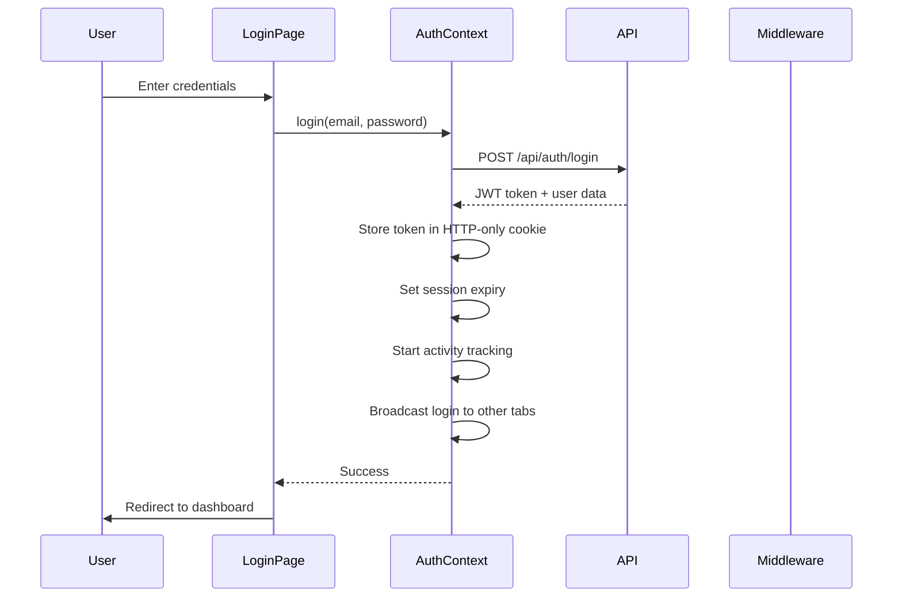
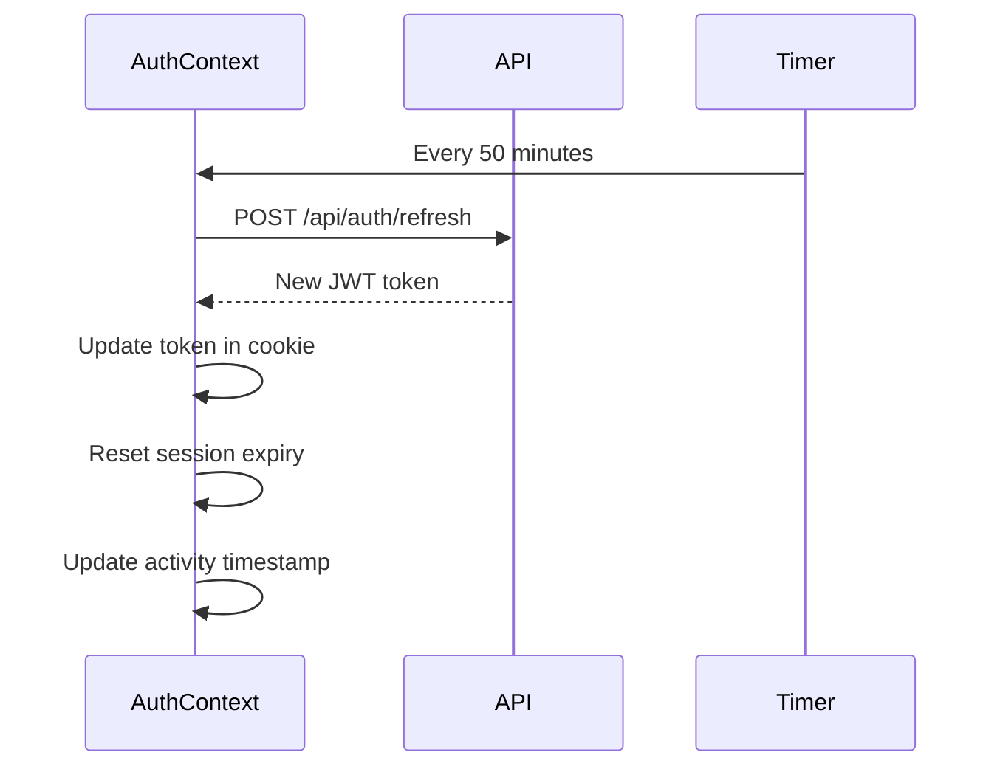
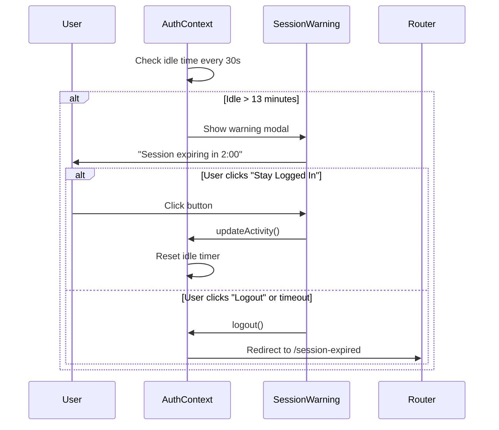

# Authentication & Security Implementation

**Version**: 1.0.0
**Last Updated**: 2025-10-26
**HIPAA Compliant**: Yes

## Overview

This document describes the comprehensive authentication, authorization, and security implementation for the White Cross Next.js application. The system is designed to meet HIPAA compliance requirements while providing a secure and accessible user experience.

## Table of Contents

1. [Authentication Flow](#authentication-flow)
2. [Authorization Patterns](#authorization-patterns)
3. [Security Features](#security-features)
4. [HIPAA Compliance](#hipaa-compliance)
5. [Audit Logging](#audit-logging)
6. [Usage Guide](#usage-guide)
7. [API Reference](#api-reference)

---

## Authentication Flow

### 1. Login Process



### 2. Token Refresh Process



### 3. Session Timeout Process



---

## Authorization Patterns

### Role Hierarchy

```
VIEWER (Level 1)
  ↓
STAFF (Level 2)
  ↓
COUNSELOR (Level 3)
  ↓
NURSE (Level 4)
  ↓
SCHOOL_ADMIN (Level 5)
  ↓
DISTRICT_ADMIN (Level 6)
  ↓
ADMIN (Level 7)
```

Higher roles inherit permissions from lower roles.

### Permission-Based Access Control

The system uses granular permissions for fine-grained access control:

```typescript
// Permission format: <resource>:<action>
'students:view'         // View student records
'students:create'       // Create new students
'students:edit'         // Edit existing students
'students:delete'       // Delete students

'health_records:view'   // View health records (PHI)
'health_records:create' // Create health records
'health_records:edit'   // Edit health records
'health_records:delete' // Delete health records

'medications:administer' // Administer medications
'admin:users'           // Manage users
'admin:audit_logs'      // View audit logs
```

### Role-Based Route Protection

```typescript
const ROUTE_PERMISSIONS = {
  '/admin': ['ADMIN', 'DISTRICT_ADMIN'],
  '/inventory': ['ADMIN', 'NURSE', 'SCHOOL_ADMIN'],
  '/reports': ['ADMIN', 'DISTRICT_ADMIN', 'SCHOOL_ADMIN'],
  '/health-records': ['ADMIN', 'NURSE', 'SCHOOL_ADMIN', 'DISTRICT_ADMIN'],
  '/medications': ['ADMIN', 'NURSE', 'SCHOOL_ADMIN'],
};
```

---

## Security Features

### 1. CSRF Protection

**Implementation**: Token-based CSRF protection for all state-changing operations.

```typescript
// Token generation (session-based)
const csrfToken = generateCSRFToken(); // Cryptographically secure
sessionStorage.setItem('csrf_token', csrfToken);

// Request validation
headers['X-CSRF-Token'] = csrfToken;
```

**Coverage**:
- All POST, PUT, PATCH, DELETE requests
- Validated in middleware
- Token rotation on login

### 2. XSS Prevention

**Techniques**:
- Input sanitization on all user inputs
- HTML escaping for display
- Content Security Policy (CSP) headers
- No `dangerouslySetInnerHTML` without sanitization

```typescript
// Sanitize user input
const sanitized = sanitizeHTML(userInput);

// CSP Header
Content-Security-Policy: default-src 'self'; script-src 'self' https://cdn.jsdelivr.net
```

### 3. Security Headers

All responses include comprehensive security headers:

```http
X-Frame-Options: DENY
X-XSS-Protection: 1; mode=block
X-Content-Type-Options: nosniff
Referrer-Policy: strict-origin-when-cross-origin
Strict-Transport-Security: max-age=31536000; includeSubDomains; preload
Content-Security-Policy: [detailed policy]
Permissions-Policy: geolocation=(), microphone=(), camera=()
```

### 4. Rate Limiting

**Configuration**:
- General API: 100 requests per 15 minutes
- Auth endpoints: 5 attempts per 15 minutes
- PHI routes: 60 requests per minute

**Implementation**: In-memory rate limiting (Redis recommended for production)

### 5. Data Encryption

**At Rest**:
- Client-side AES-GCM encryption for sensitive data
- 256-bit keys
- Random IV per encryption

**In Transit**:
- HTTPS enforced (HSTS header)
- TLS 1.2+ required
- Certificate pinning recommended

---

## HIPAA Compliance

### Compliance Checklist

- [x] **Access Control**: Role-based access control implemented
- [x] **Audit Logging**: All PHI access logged with user, timestamp, action
- [x] **Session Timeout**: 15-minute idle timeout enforced
- [x] **Encryption**: Data encrypted at rest and in transit
- [x] **Authentication**: Strong password policy (12+ chars, complexity)
- [x] **Authorization**: Granular permission checking
- [x] **Session Management**: Automatic logout, session invalidation
- [x] **Activity Tracking**: User activity monitored and logged
- [x] **Failed Login Tracking**: Failed attempts logged for security
- [x] **Password Reset**: Secure token-based reset flow

### Session Management

**Idle Timeout**: 15 minutes (HIPAA requirement)
**Warning Time**: 2 minutes before expiry
**Max Session**: 24 hours
**Token Refresh**: Every 50 minutes

### PHI Protection

**PHI Routes** (require audit logging):
- `/health-records/*`
- `/medications/*`
- `/students/*`
- `/emergency-contacts/*`

**Audit Log Entry**:
```json
{
  "eventType": "PHI_VIEW",
  "userId": "user-123",
  "userEmail": "nurse@school.edu",
  "userRole": "NURSE",
  "resourceType": "health_record",
  "resourceId": "record-456",
  "action": "view",
  "timestamp": "2025-10-26T17:00:00Z",
  "ipAddress": "192.168.1.1",
  "success": true
}
```

---

## Audit Logging

### Event Types

**Authentication Events**:
- `LOGIN_SUCCESS`
- `LOGIN_FAILURE`
- `LOGOUT`
- `TOKEN_REFRESH`
- `SESSION_EXPIRED`
- `PASSWORD_RESET_REQUEST`

**Authorization Events**:
- `ACCESS_DENIED`
- `PERMISSION_CHECK`
- `ROLE_CHECK`

**PHI Access Events**:
- `PHI_VIEW`
- `PHI_CREATE`
- `PHI_UPDATE`
- `PHI_DELETE`
- `PHI_EXPORT`
- `PHI_PRINT`

**Security Events**:
- `SECURITY_VIOLATION`
- `CSRF_FAILURE`
- `RATE_LIMIT_EXCEEDED`

### Audit Service Usage

```typescript
import { auditService, AuditEventType, AuditSeverity } from '@/services/audit/AuditService';

// Log PHI access
auditService.logPHIAccess({
  userId: user.id,
  userEmail: user.email,
  userRole: user.role,
  resourceType: 'health_record',
  resourceId: recordId,
  action: 'view',
  success: true,
  details: { recordType: 'immunization' }
});

// Log authentication event
auditService.logAuth({
  eventType: AuditEventType.LOGIN_SUCCESS,
  userId: user.id,
  userEmail: user.email,
  success: true
});

// Log access denied
auditService.logAccessDenied({
  userId: user.id,
  userEmail: user.email,
  userRole: user.role,
  resourceType: 'admin_panel',
  requiredPermission: 'admin:users',
  reason: 'Insufficient permissions'
});
```

### Log Retention

- **Retention Period**: 7 years (HIPAA requirement)
- **Storage**: Server-side database with backup
- **Access**: Admin and compliance officers only
- **Export**: CSV, JSON, PDF formats available

---

## Usage Guide

### 1. Protecting Routes

```tsx
// Page-level protection
import { ProtectedRoute } from '@/components/auth/ProtectedRoute';

export default function AdminPage() {
  return (
    <ProtectedRoute requiredRole="ADMIN">
      <AdminDashboard />
    </ProtectedRoute>
  );
}

// Permission-based protection
<ProtectedRoute requiredPermission="students:edit">
  <StudentEditForm />
</ProtectedRoute>
```

### 2. Conditional Rendering

```tsx
// Component-level authorization
import { PermissionGate } from '@/components/auth/PermissionGate';

<PermissionGate permission="students:edit">
  <EditButton onClick={handleEdit} />
</PermissionGate>

// Role-based rendering
<PermissionGate role={['ADMIN', 'DISTRICT_ADMIN']}>
  <AdminPanel />
</PermissionGate>

// Multiple permissions (require all)
<PermissionGate
  permissions={['students:view', 'students:edit']}
  requireAll
>
  <StudentForm />
</PermissionGate>
```

### 3. Using Auth Hooks

```tsx
import { useAuth } from '@/contexts/AuthContext';
import { useHasPermission, useHasRole } from '@/hooks/usePermissions';

function MyComponent() {
  const { user, logout, hasRole, hasPermission } = useAuth();
  const canEditStudents = useHasPermission()('students:edit');
  const isAdmin = useHasRole()('ADMIN');

  return (
    <div>
      <p>Welcome, {user?.firstName}!</p>
      {canEditStudents && <EditButton />}
      {isAdmin && <AdminMenu />}
      <button onClick={logout}>Logout</button>
    </div>
  );
}
```

### 4. Manual Permission Checks

```tsx
import { useAuth } from '@/contexts/AuthContext';

function ActionButton() {
  const { hasPermission } = useAuth();

  const handleAction = () => {
    if (!hasPermission('students:edit')) {
      toast.error('You do not have permission to edit students');
      return;
    }

    // Proceed with action
    editStudent();
  };

  return <button onClick={handleAction}>Edit Student</button>;
}
```

---

## API Reference

### AuthContext

```typescript
interface AuthContextValue {
  user: User | null;
  isAuthenticated: boolean;
  isLoading: boolean;
  error: string | null;
  sessionExpiresAt: number | null;
  lastActivityAt: number;
  login: (email: string, password: string, rememberMe?: boolean) => Promise<void>;
  logout: () => Promise<void>;
  refreshToken: () => Promise<void>;
  clearError: () => void;
  updateActivity: () => void;
  checkSession: () => boolean;
  hasRole: (role: string | string[]) => boolean;
  hasPermission: (permission: string) => boolean;
}
```

### Permission Hooks

```typescript
// Check single permission
const hasPermission = useHasPermission();
hasPermission('students:edit'); // boolean

// Check role
const hasRole = useHasRole();
hasRole('ADMIN'); // boolean
hasRole(['ADMIN', 'DISTRICT_ADMIN']); // boolean

// Check minimum role level
const hasMinRole = useHasMinRole();
hasMinRole('SCHOOL_ADMIN'); // true if SCHOOL_ADMIN, DISTRICT_ADMIN, or ADMIN

// Check all permissions
const hasAllPermissions = useHasAllPermissions();
hasAllPermissions(['students:view', 'students:edit']); // boolean

// Check any permission
const hasAnyPermission = useHasAnyPermission();
hasAnyPermission(['students:create', 'students:edit']); // boolean

// Get all user permissions
const permissions = useUserPermissions();
// Returns: Permission[]
```

### Security Utilities

```typescript
// CSRF
import { getCSRFToken, addCSRFHeader } from '@/lib/security/csrf';

const token = getCSRFToken();
const headers = addCSRFHeader({ 'Content-Type': 'application/json' });

// Sanitization
import { sanitizeHTML, sanitizeEmail, sanitizePhone } from '@/lib/security/sanitization';

const safe = sanitizeHTML(userInput);
const email = sanitizeEmail(rawEmail);

// Encryption
import { encryptData, decryptData, hashData } from '@/lib/security/encryption';

const encrypted = await encryptData(sensitiveData, key);
const decrypted = await decryptData(encrypted, key);
const hash = await hashData(password);
```

---

## Files Created

### Core Authentication
- `src/contexts/AuthContext.tsx` - Authentication context and provider
- `src/hooks/usePermissions.ts` - Permission and role hooks
- `src/components/auth/ProtectedRoute.tsx` - Route protection component
- `src/components/auth/PermissionGate.tsx` - Conditional rendering component

### Authentication Pages
- `src/app/(auth)/login/page.tsx` - Login page
- `src/app/(auth)/session-expired/page.tsx` - Session expired page
- `src/app/(auth)/access-denied/page.tsx` - Access denied page

### Security
- `src/middleware.enhanced.ts` - Enhanced middleware with full security
- `src/lib/security/config.ts` - Security configuration
- `src/lib/security/csrf.ts` - CSRF protection utilities
- `src/lib/security/sanitization.ts` - Input sanitization utilities
- `src/lib/security/encryption.ts` - Encryption utilities

### Audit Logging
- `src/services/audit/AuditService.ts` - Comprehensive audit logging service

---

## Next Steps

1. **Replace `middleware.ts` with `middleware.enhanced.ts`**:
   ```bash
   mv src/middleware.ts src/middleware.old.ts
   mv src/middleware.enhanced.ts src/middleware.ts
   ```

2. **Update `providers.tsx`** to include AuthProvider (manual integration needed)

3. **Create remaining auth pages**:
   - Forgot password page
   - Reset password page
   - Logout confirmation page

4. **Implement backend audit log storage**:
   - Create `/api/audit/log` endpoint
   - Set up database table for audit logs
   - Implement log retention policy

5. **Add MFA support** (optional):
   - TOTP-based two-factor authentication
   - SMS-based verification
   - Backup codes

6. **Testing**:
   - Unit tests for all hooks and utilities
   - Integration tests for auth flows
   - E2E tests for login/logout/session expiry
   - Security penetration testing

---

## Support

For questions or issues related to authentication and security, contact:
- **Security Team**: security@whitecross.edu
- **Development Team**: dev@whitecross.edu
- **HIPAA Compliance**: compliance@whitecross.edu

---

**Document Version**: 1.0.0
**Last Review**: 2025-10-26
**Next Review**: 2026-01-26
